## Instalación y despliegue. 
# 📁 Guía de instalación y configuración del proyecto

Esta guía explica cómo descargar, preparar y configurar el **PROYECTO_CARTAS**, incluyendo la instalación del macro de Word y la actualización de la información de la maestra de personal.

---

## 1️⃣ Descargar el proyecto como archivo `.zip`
1. Ingresa al repositorio en línea del proyecto. (Suministrado al momento de instalación. )

2. Haz clic en el botón **Code**.

3. Selecciona **Download ZIP**.

---

## 2️⃣ Descomprimir la carpeta del proyecto
1. Ubica el archivo `.zip` descargado.

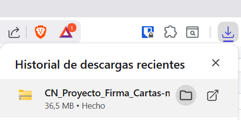

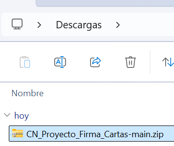

2. Elegimos una carpeta para guardar el proyecto. Preferiblemente una ruta de facil acceso. Al mover la carpeta allí podemos continuar. 

2. Haz clic derecho en la carpeta descargada y le damos un click y en la parte superior presionamos el boton **Extraer todo**.

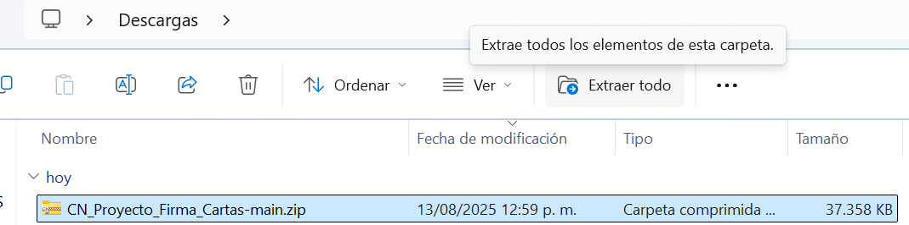

Click en **Extraer**

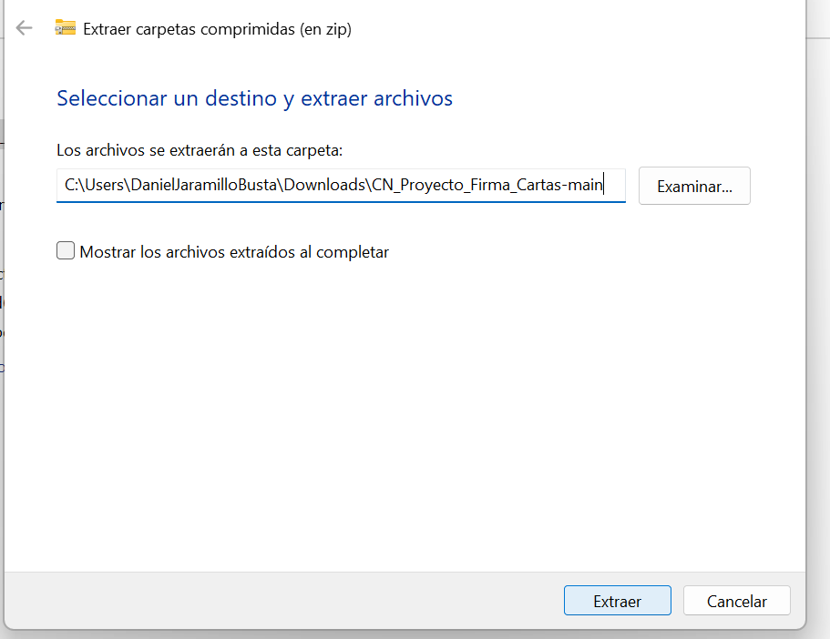

Así ya tenemos la carpeta del proyecto. 

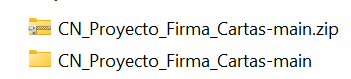

---

## 3️⃣ Descomprimir el entorno virtual
El proyecto incluye un entorno virtual comprimido (`python-3.12.5-emb.zip`).

> ⚠ **Importante:** No extraigas este archivo directamente en la carpeta raíz, ya que el descompresor de Windows creará una subcarpeta adicional.

Pasos recomendados:
1. Abre el `.zip` del entorno virtual.

2. Copia la carpeta completa  📁python-3.12.5-emb

3. Pégalo directamente dentro de la carpeta raíz del proyecto (no dentro de una subcarpeta nueva) es decir pegalo en la carpeta anterior. 
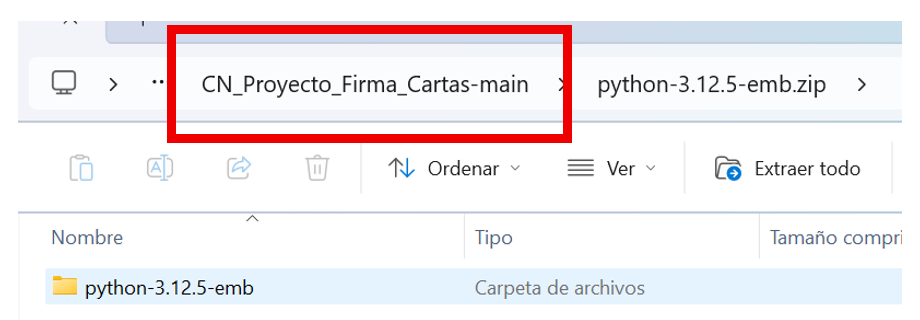
---

Nos debe quedar de esta manera. 
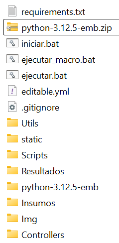

## 4️⃣ Configurar macro para la automatización. (OPCIONAL PERO RECOMENDADO)

1. Entrar al archivo en : 📁Insumos/**Macro_Word.txt**

2. Abrimos el archivo, selecionamos y copiamos todo su contenido. 

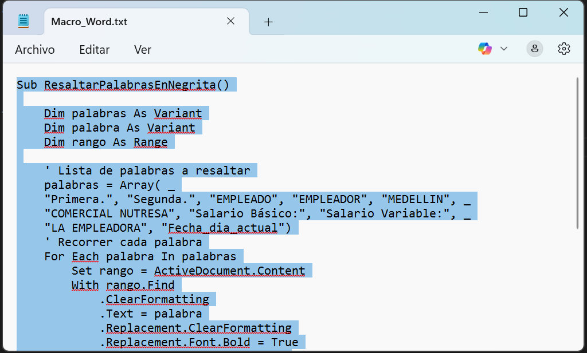

3. Abrimos **microsoft word** creando un docmuento en blanco.

4. Una vez allí vamos a la barra superior presionado en **``Vista->Macros_Ver Macros``**
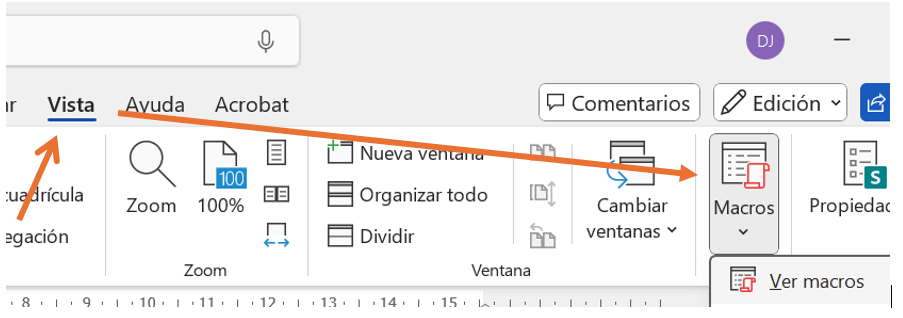

Se nos abrirá esta ventana. 

Podemos asignarle el nombre deseado en la parte superior y luego presionamos el boton **Crear**

- Se nos abrira una ventana como esta:

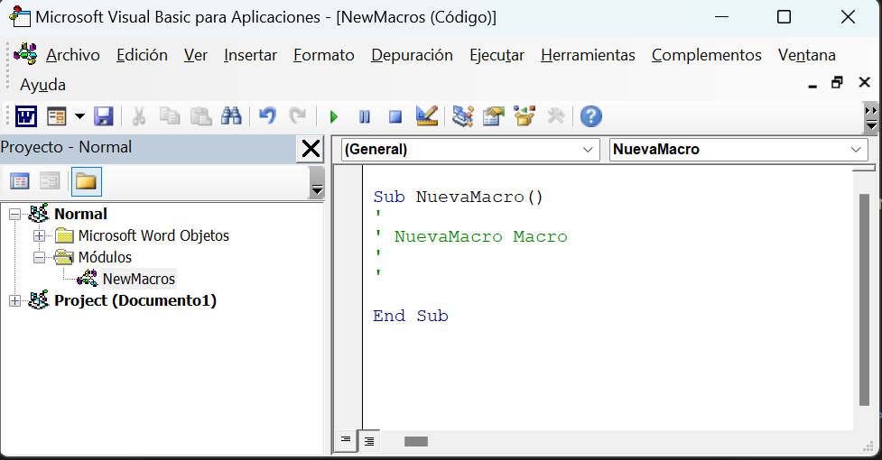

- En la parte superior izquierda iremos a **``Microsoft word Objetos``** y dando doble click veremos **``ThisDocument``** ó **``EsteDocumento``**.  Y aí hacemos doble Click.

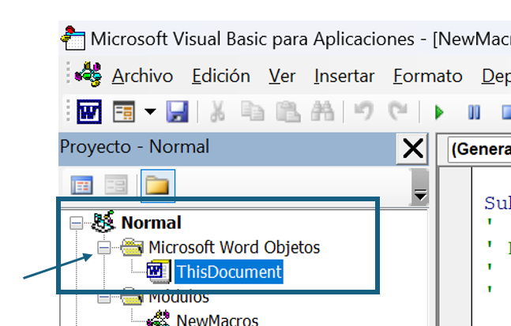

Dentro de esta hoja pegaremos el contenido copiado del archivo **Macro.txt** , **recomendación:  (Utilizar Click derecho + Pegar)**. Guardamos los cambios. 

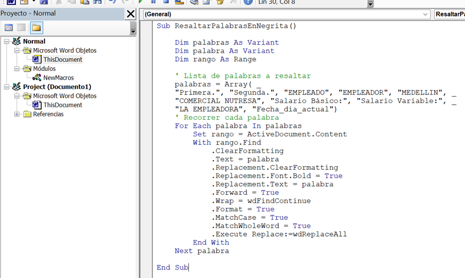

## 4️⃣ Actualizar información de la **maestra de personal**
La información que se usa para diligenciar los formatos está en:

📁Insumos/maestra_personal/Maestra de personal.xlsx

